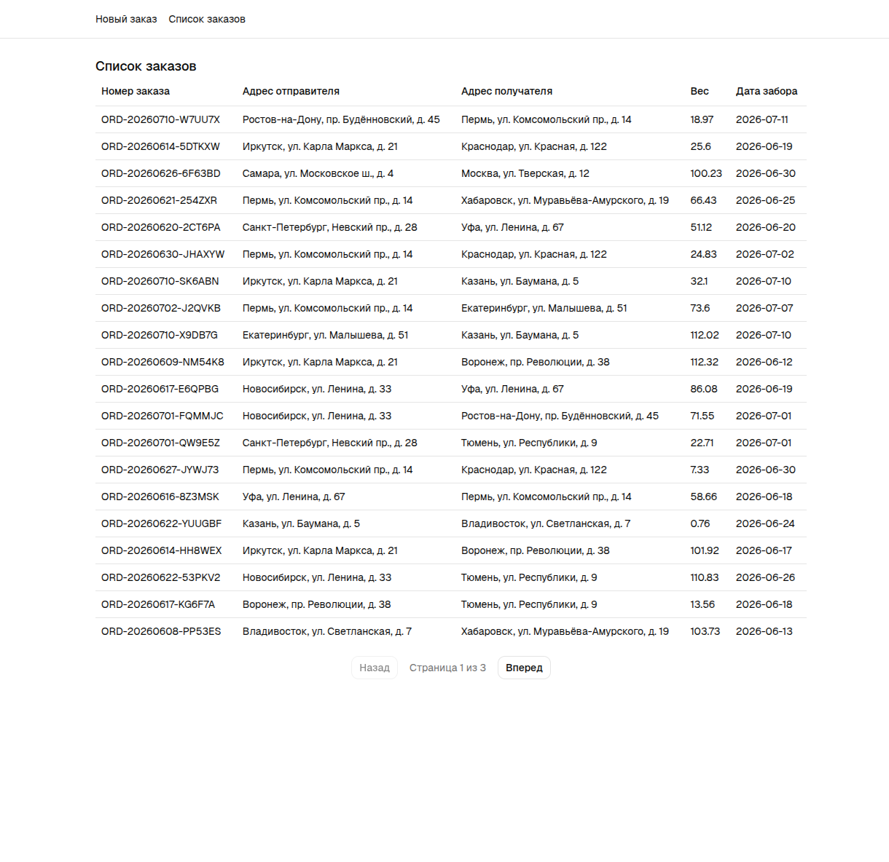
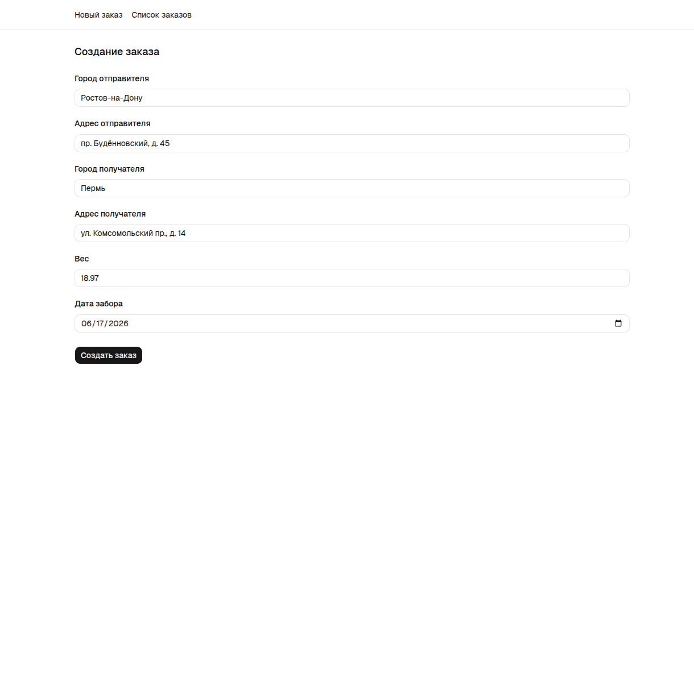
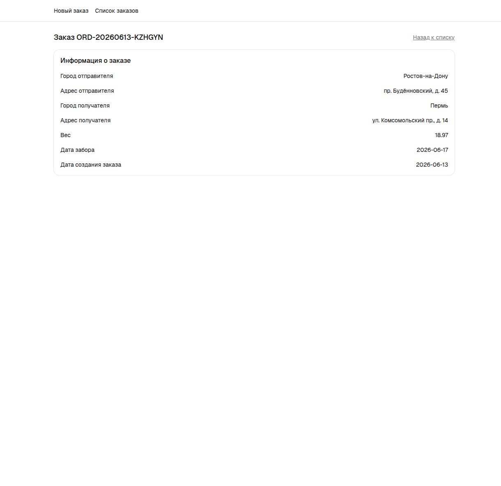
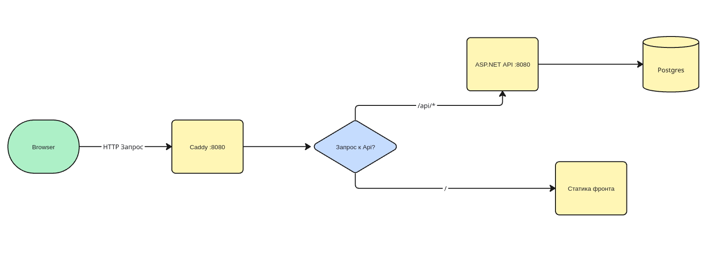
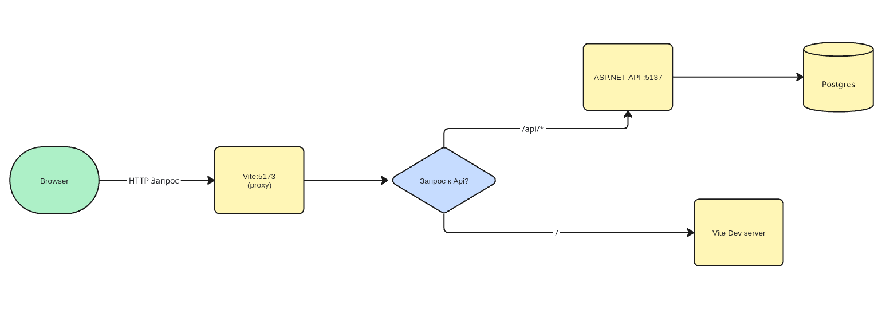

# Тестовое задание на позицию C# разработчика

<table>
    <tr>
        <td></td>
        <td></td>
        <td></td>
    </tr>
</table>

## Подготовка окружения
Клонируем репозиторий
```
git clone git@github.com:ka-shmd/versta_test.git
```

Переходим в папку проекта и создаем файл переменных окружения. 
(Для использования дефолтных значений можно просто скопировать пример)
```
cd versta_test
cp .env.example .env
```

## Быстрый старт
Для быстрого запуска на машине должны быть установлены Docker и Docker Compose.

Запускаем проект в docker compose
```
docker compose up --build
```

Готово. Приложение запущено и доступно локально по адресу http://localhost:8080

## Запуск в Dev окружении
Для запуска необходимо: .NET9 SDK, Node.js 22+, Docker, Docker Compose. <br/>
Также, если еще не установлены, нужно установить [инструменты Entity Framework](https://learn.microsoft.com/en-us/ef/core/cli/dotnet).

После [подготовки](#подготовка-окружения) поднимаем БД

```
docker compose up -d db
```

Готовим сервер
```
cd src/server/VerstaDelivery.Api
dotnet ef database update
```
Запускаем сервер в терминале
```
dotnet run
```
... или из удобной IDE

Запускаем клиент (в другом терминале)
```
cd src/client
npm ci
npm run dev
```

Готово. Потрогать приложение можно тут:

- Ui - http://localhost:5173
- Api - http://localhost:5137
- Ui для тестирования Api - http://localhost:5137/scalar

## Функциональность
- **Создание заказа** - форма с 6 обязательными полями.
- **Список заказов** - таблица с деталями заказов и идентификаторами.
- **Просмотр заказа** - просмотр деталей конкретного заказа. Открывается по клику в таблице или при успешном добавлении нового заказа.

## Стек проекта
- **Backend**: ASP.NET 9, MinimalAPI, EFCore, PostgreSql, FluentValidation, Serilog
- **Frontend**: React, TypeScript, Vite, TanStack, react-hook-form, zod, Tailwind, shadcn/ui
- **Инфраструктура**:  Docker Compose, Caddy, GitHub Actions

## Архитектура
Приложение представляет собой монорепозиторий и состоит из трех частей:

Сервер - ASP.NET 

Клиент - React SPA + прокси (Caddy / Vite proxy)

БД - PostgreSql

### Схема работы в prod окружении


### Схема работы в dev окружении


### Ключевые решения
#### Структура серверной части
По ТЗ проект предполагает минимальное количество бизнес логики и всего одну доменную сущность. Показалось, что для этого задания делать слоеную архитектуру - это избыток. Вся логика сервера скомпанована в один проект (+тесты), а для поддержания структуры код логически вынес по папкам.

Если представить, что проект будет расти, то папки легко вынести в отдельные проекты-слои и создать строгую изоляцию в решении. Endpoints, DTOs - Api / Models - Core / Migrations, Data - Infrastructure / Services, Validation - Application

#### Эндпоинты на Minimal Api
Для Api слоя выбирал между Контроллерами и Minimal Api. По структуре с контроллерами было бы тоже самое - отдельный класс с тремя методами-эндпоинтами. Выбрал именно Minimal Api, так как этот подход для проекта с малым количеством эндпоинтов проще в написании - меньше атрибутов, из сигнатуры метода понятно, какие статусы возвращаем, DI прямо через параметры метода. Но в целом считаю, что в этом случае разница не принципиальна. Выбрал Minimal Api потому что просто захотел.

#### Связь клиент - Api
Фронт делает запросы к бэку по относительным путям через реверс прокси. В дев их принимает Vite и проксирует на бэк. В Docker в качестве прокси используется Caddy. В браузере запросы выглядят как same-origin.

В проде Caddy делает две вещи - проксирует запросы к /api/* на контейнер с Api и отдает собраную статику от React. Решил их обьеденить, чтобы было меньше сервисов.

Альтернативой прокси было просто запустить бэк и фронт на разных портах и настроить CORS. Отказался от этого варианта, так как 
1) Фронт и бэк - монорепо
2) Веб сервер (в нашем случае Caddy) в любом случае пришлось бы поднимать для раздачи статики фронта.

#### Формат номера заказа
Номер генерируется на бэке при создании заказа. Формат: статичный префикс - дата - постфикс. Дата - календарный день, совпадает с днем создания заказа (удобно для группировки / фильтрации), постфикс - набор из случайных цифр или букв (без неоднозначных символов). Такой подход показался мне лучше простого инкремента, так как не нужно думать о состоянии гонки, нет проблем с безопасностью (нельзя угадать следующий номер). Также такой номер - человекочитаем - проще найти заказ по последним 6 символам, чем по 32 в guid (имею ввиду, что 6 символов можно продиктовать или визуально сравнить). 

Коллизия при таком подходе маловероятна, но возможна. Поэтому предусмотрена защита от такой ситуации. Unique индекс по полю номера заказа + ретрай при ошибке от бд.

#### Валидация
В проекте есть 2 уровня валидации - на клиенте и в Api.

На Api используется FluentValidation для dto запроса на создание заказа. Проверяем длину текстовых полей, нижнюю границу веса, дата не должна быть в прошлом. Ошибки отдаем через ProblemDetails.

На клиенте используется zod и react-hook-form. Ограничения аналогичные Api. Все ошибки подсвечивваются в форме. Дублирование тут для быстрой обратной связи и избежания отправки некорректных запросов на бэк. Проверка на бэке - источник истины, на случай, если запрос придет не с фронта.

Дополнительно часть ограничений накладывается через констрейнты в БД.

#### Тестирование
Бэкенд покрыл юнит и интеграционными тестами. Юнит на генератор заказов и на валидацию. Интеграционные тесты поднимают Postgres через Testcontainers, накатывают миграции и гоняют Api по HTTP.

## CI
После уточнения критериев приема задания выяснил, что желательно делать приближено к реальному проду. Поэтому я решил реализовать CI. 
Сейчас при пуше или создании пулл реквеста в main в этом репозитории запускается GitHub Action. [Workflow](.github/workflows/ci.yml) содержит 3 джобы:
- **backend**: Готовим .Net 9, подтягиваем зависимости и гоняем тесты (юнит и интеграционные).
- **frontend**: Готовим node 22, подтягиваем зависимости, гоняем lint и typecheck, билдим.
- **docker**: Сборка образов Api и proxy (завасит от backend и frontend. запускается последней, чтобы не гонять, если другая джоба упадет).

Также в репозитории работает Dependabot - еженедельно делает PR с обновлениями Nuget и npm.